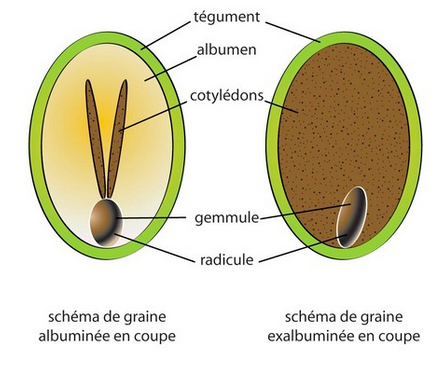

# technique de semis

# Condition de germination

## description de la graine

## Condition de germination

- Pourquoi une graine germe : pour permétuer l'espèce
- condition de germination
  - température de germination + Humidité
- Phase de germination :
  1. levé => température de germination, durée de germination (degrés /jour)
  1. cotylédon => la plante comment la photosynthèse
  1. 2 feuilles => la plante a développé son système racinaire
  1. 4 feuilles => La plante est prête pour le repiquage (Limace)

# exemple : la tomate

    1. Départ = Graine, ou sachet de graine
    1. Arrivée = une tomate prête à manger

## Semer (comment)

- Mettre une graine en terre afin de la faire germer
- Oui cependant; semer comment ?
  1. Terrine => prends peu de place ( 20 graines dans un godet de 7x7)
  1. Godet individuel => Pas de repiquage racine nue
  1. Mini-motte => Pas besoin de godet
  1. Direct dans le jardin => Pas besoin de repiquage

Et pourquoi, ce n’est pas possible.

## Semer (ou)

- Mettre une graine en terre afin de la faire germer
- Oui cependant, semer ou ? 1. Direct : température du sol, risque de zéro vegetative ? 1. sous abris : place disponible + Repiquage 1. au chaud : Surveillance +place disponible + Repiquage
  Et pourquoi, ce n’est pas possible.

## Semer (méthode)

- Oui mais semer par quel méthode ?
  1. Individuel : qualité des graines (taux de germination)
  1. En poquet: travail d’éclaircissage
  1. En ligne : (individuel ou en poquet)
  1. A la volée : eclaircissage + taux de germination
     Et pourquoi, ce n’est pas possible.

# substrat

## coton

    1. Phase levée : coton
    1. Phase cotylédon : coton
    1. phase 2 feuilles : coton + nutriment
    1. Phase 4 feuilles : coton + nutriment

## terreau

    1. Phase levée : Terreau
    1. Phase cotylédon : Terreau
    1. phase 2 feuilles : Terre de jardin
    1. Phase 4 feuilles : Terre de jardin

## terre du jardin

    1. Phase levée : Terre
    1. Phase cotylédon : Terre
    1. phase 2 feuilles : Terre
    1. Phase 4 feuilles : Terre

# Substrat comparatif simplet

| terreau                                           | compost                                                             |
| ------------------------------------------------- | ------------------------------------------------------------------- |
| 0,1€/litre : déchet des plateforme de déchet vert | 1€/litre : déchet des plateforme de déchet vert (coût de transport) |
| Chauffé à 70°c                                    | Non chauffé (présence de graine et pathogène)                       |
| Abondant                                          | Provenance de fumier                                                |
|                                                   | Peu de fournisseur                                                  |

# fiche technique exemple Tomate

| item                         | value                 |
| ---------------------------- | --------------------- |
| Température de germination   | (Min) 18 °c           |
| Durée de germination         | (Min/max) (7-10 jour) |
| Zéro végétation              | (13 °c)               |
| Température de culture idéal | (min/max) (17/25)     |
| Durée de culture (min/max)   | (120/150)             |
| Rendement                    | (6 à 10kg / ml)       |
| Profondeur de semis          | (1 à 3 mm)            |
| Inter-plante                 | (50 cm)               |
| Inter-ligne                  | (50 cm)               |

# suivi des semis

| item                                                | role                            |
| --------------------------------------------------- | ------------------------------- |
| Numéro                                              | numéro chrono                   |
| Variété                                             | nom du cultivar                 |
| Attribution (planche)                               | lieu de semis                   |
| Date semis                                          | pour connaitre la récolte       |
| Température semis (au chaud, sous abris, extérieur) | pou connaitre la date de levé   |
| Prochaine étape                                     | pour se préparer                |
| Date de levé                                        | pour information et évolution   |
| sous abris ou châssis                               | info ++                         |
| Date repiquage                                      | godet disponible                |
| Date de plantation                                  | planche disponible              |
| Date de récolte                                     | prochaine plantation            |
| Quantité récolté                                    | pour savoir comment de plant    |
| Graine                                              | provenance, grainothèque        |
| Remarques                                           | toutes les remarques nécessaire |
