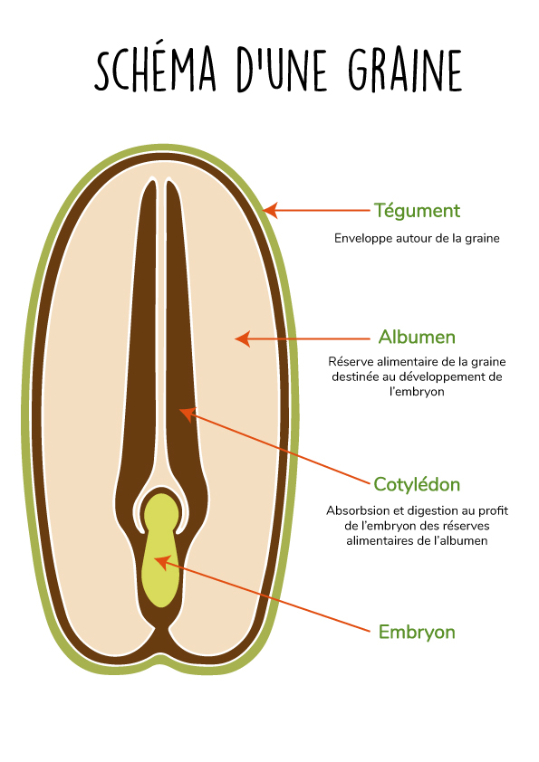
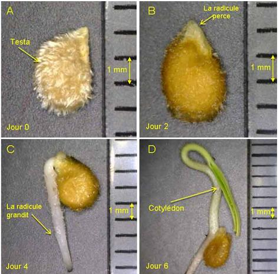
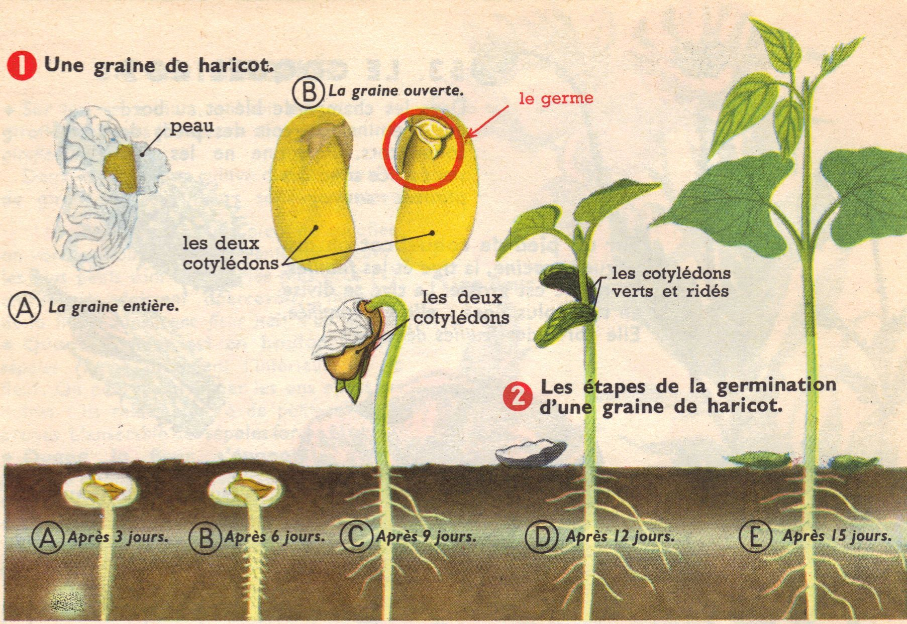
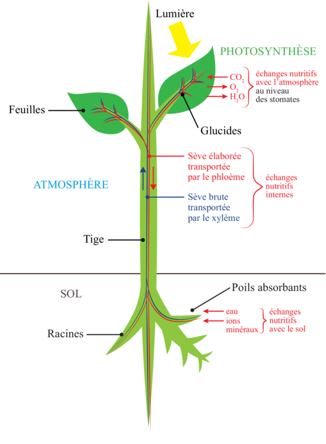
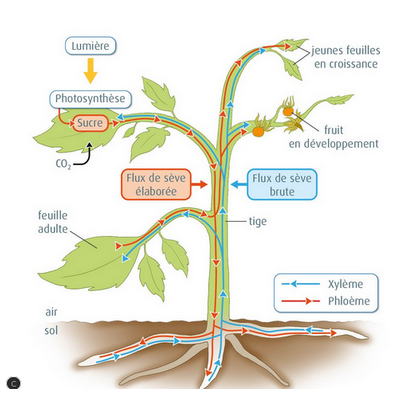
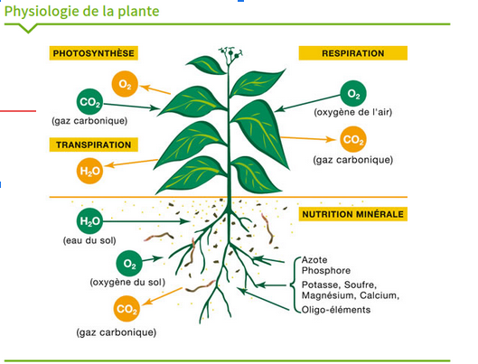
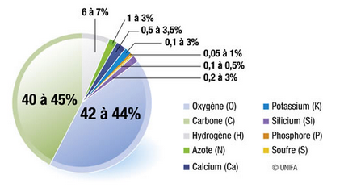
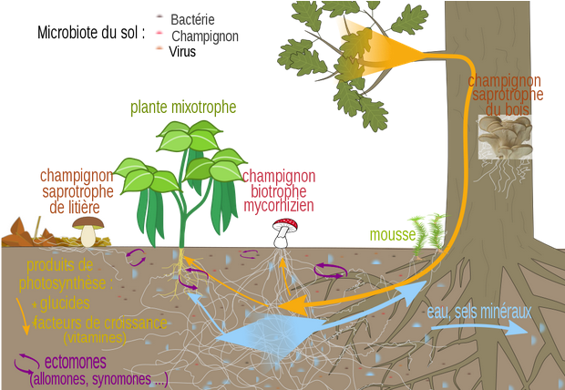
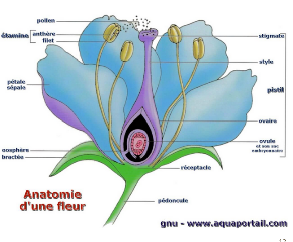

# Le végétal

# Sommaire

[semis](#semis)
[Germination](#germination)
[croissance](#croissance)
[Fructification](#fructification)
[Nom scientifique](#nom-scientifique)
[A quoi ca va nous servir ? ](#a-quoi-ca-va-nous-servir)

# Semis

## Condition de germination

1. humidité
1. oxygène (l'air)
1. chaleur

## Levée de dormance

1. par le froid = vernalisation;
1. par l'cidité = digéré
1. Mécanique = une abrasion
1. flamme = pyrophyles
1. Eau = hydrophobe.

## constitution d'une graine

# Germination

1. cotylédon
1. photosynthese

germination

## Circulation dans une plante

### explication

1. 90 à 96% de la matière sèche des plantes provient uniquement des atomes de carbone, d’hydrogène et d’oxygène fournis par les gaz O2 et CO2 et par l’eau.
1. L’azote, le phosphore, le potassium, le calcium et les autres éléments minéraux incluant les oligo-éléments constituent le reste de la matière sèche.
1. La composition des végétaux en éléments minéraux varie en fonction de l’espèce, de l’âge et de la nature des organes et de la composition du sol.

## Repiquage et Plantation

Physiologie de la plante

Besoin de la plante pour sa croissance : (classé par quantité décroissante)

# Croissance

Réseau mycorhizien
CHON( 89 à 95% atm)
minéraux (terroir)

# Fructification

### Asexué

1.  Bouture
1.  Marcotte
1.  Drageon
1.  Stolon

### Sexué

1.  Hermaphrodites (bisexuée)
1.  Monoïques possède organe male et femelle)
1.  Dioïques (individue mal ou femelle)

### Fécondation

1. Autogame (autofécondation)
1. Allogame

### Pollinisateur

1. vent
1. insecte
1. mammifère

### reproduction

1. sexué  
   Fleuraison  
   fécondation  
   Fructification
1. Plante  
   autogame  
   allogame
1. Naissance de la graine

## Catégorie de plantes

1. Herbacée : sans lignine
1. Ligneuse

- Plantes annuelles :
- Plantes bisannuelles :
- Plantes vivaces :

# nom scientifique

1. nom scientifique (exemple tomate Solanum lycopersicum)
1. intérêt (nom unique international)

- classification
- règne
- classe
- ordre
- famille
- genre
- espèce
- cultivar.

# A quoi ca va nous servir .

Revoir les slides depuis le début

# Fin
